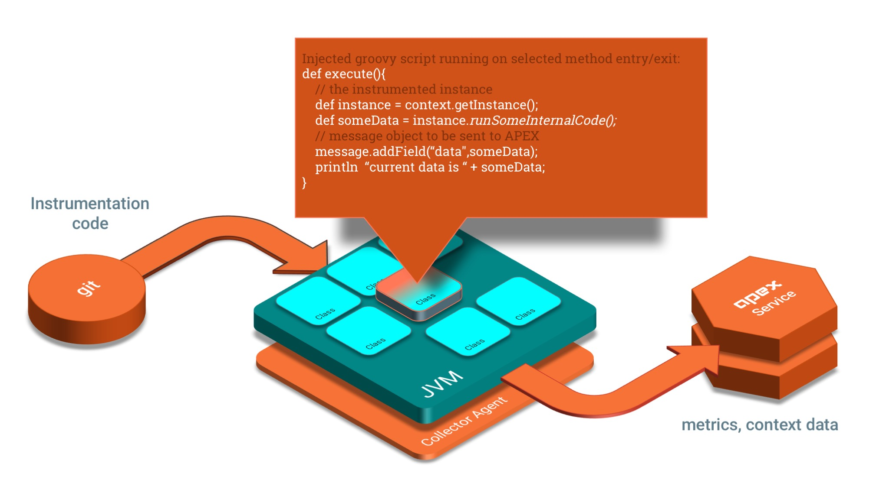

apex-toolkit
============

About
-----

APEX extracts contextual data and metrics directly from your Java application.

It helps getting better visibility and understanding of what is happening in the software products' application layer during runtime.
Designed to accelerate application analytics, debugging and monitoring.

APEX subprojects
----------------

* [Collector Agent](https://github.com/verticle-io/apex-toolkit)
* [Service Template](https://github.com/verticle-io/apex-service-template)
* [Instrumentation Repository](https://github.com/verticle-io/apex-instrumentation-repo)

Please visit the [APEX Toolkit Site](http://toolkit.verticle.io) and check out the docs for details.

Contributing
------------
We are happy to receive PRs for the toolkit. If you find bugs or ideas for enhancements please use the issue tracker.
